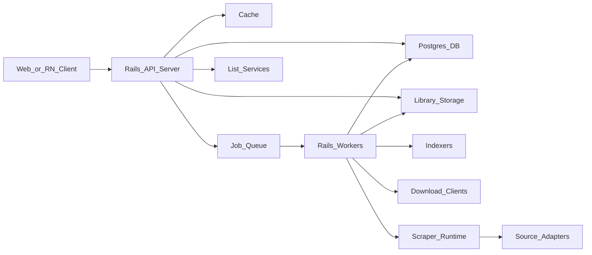
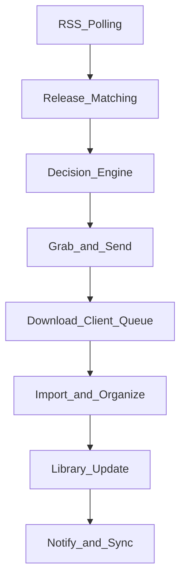

# Manga Manager Design Spec

Status: Draft  
Date: 2026-02-01  
Audience: Solo builder  

## Summary

Build a self-hosted manga manager and reader with Sonarr-like automation. The system discovers, downloads, and organizes manga from diverse sources (trackers, usenet, scanlation sites) and supports multi-language libraries. It provides a modern web and mobile reader experience, integrates with AniList/MAL/Kitsu, uses a first-party scraper framework, and supports pluggable storage backends (NAS/S3). Strong network controls (proxy/VPN) and security boundaries protect users and the host.

## Goals

- Automated discovery and acquisition for monitored series.
- Multi-language support per user and per series.
- Reliable, configurable download and import pipeline.
- Excellent reading experience on web and mobile.
- Extensible source ecosystem via first-party scraper adapters.
- Bidirectional list sync (AniList/MAL/Kitsu).
- Secure, self-hosted deployment with proxy/VPN support.

## Non-Goals

- No SaaS or hosted content.
- No bundled official content or DRM bypass.
- No replacement for full torrent/usenet clients.
- No mandatory cloud account or telemetry.

## Assumptions

- Self-hosted only (no SaaS).
- Multi-user with accounts and roles.
- Web + React Native clients.
- Modular monolith + worker queue.
- Open-source.
- Bidirectional sync with AniList, MyAnimeList, and Kitsu.
- First-party scraper framework for source ecosystem (no dependency on extension ecosystems).
- Pluggable storage backends for NAS and object storage.
- Stretch goals: Mihon client compatibility, Paperback extension, OPDS/WebDAV.

## Personas and Use Cases

- **Power reader**: wants automated downloads and clean library organization.
- **Family server**: multiple users, profiles, and preferences.
- **Collector**: builds large archives with strict naming, dedupe, and format policies.
- **Bilingual reader**: tracks multiple languages for the same series.

## Architecture Overview

The system is a self-hosted modular monolith with a Rails core API and background job queue. Source scraping is handled by a first-party scraper framework running in isolated workers or a dedicated scraper runtime. The core API owns business logic, the job workers run scheduled and long-running jobs, and the scraper runtime isolates untrusted parsing and HTTP logic behind a stable internal contract.

Core boundaries:
- **API server (Rails)**: auth, RBAC, library and metadata CRUD, search orchestration, sync triggers, client-facing API.
- **Job workers (Rails ActiveJob)**: scheduled polling, searches, decision engine, download monitoring, post-processing, sync jobs.
- **Scraper runtime**: runs first-party source adapters to access scanlation sites and other sources, returns normalized results.
- **Download clients (external)**: torrent and usenet clients via adapters.
- **Storage**: Postgres as primary DB, optional SQLite for lightweight installs; object storage or filesystem for library files; cache for hot metadata.

Scaling model:
- Single-host default with multiple job workers.
- Horizontal scaling by adding worker instances and optional external cache.
- Scraper runtime can run as a separate container for resource isolation.

System components:


Download pipeline (simplified):


## Core Components

Key services inside the modular monolith:

- **Auth and RBAC**: user accounts, roles (admin, editor, viewer), API tokens.
- **Library service**: series/volume/chapter CRUD, categories, language preferences, monitoring status.
- **Metadata service**: canonical metadata, alternate titles, author/artist, cover art, tags, publication info.
- **Source registry**: manages enabled sources, credentials, per-source policies, and rate limits.
- **Search and decision engine**: normalizes results, scores releases, applies language/quality/group rules.
- **Download service**: integrates with torrent/usenet clients, tracks queues, handles retries and blacklists.
- **Import and file processor**: extraction, verification, naming, linking, and duplicate detection.
- **Reader service**: serves pages/CBZ/CBR/PDF with streaming and prefetch, generates thumbnails.
- **Sync service**: AniList/MAL/Kitsu bidirectional sync and conflict resolution.
- **Scheduler**: cron-like jobs for polling, searches, and sync.
- **Notifications**: webhooks, email, and push hooks (future).
- **Observability**: structured logs, metrics, audit trail.

APIs:
- **REST API** for clients and integrations.
- **WebSocket/SSE** for progress updates (downloads, imports, sync).
Internal communication uses a job queue and event bus inside the monolith.

## Data Model and Storage

Core entities (expanded):
- **User**: id, email, hashed_password, role_id, preferences.
- **Role**: id, name, permissions.
- **Library**: id, name, root_path, policies.
- **Source**: id, name, type, base_url, api_version, capabilities, enabled.
- **Series**: id, canonical_title, status, type, language_policy, metadata_source_id.
- **SeriesSource**: id, series_id, source_id, source_series_id, last_checked_at.
- **AltTitle**: id, series_id, title, language, script, source.
- **Volume**: id, series_id, volume_number, title, release_date.
- **Chapter**: id, series_id, volume_id (nullable), chapter_number, title, language, group, source_id.
- **Release**: id, chapter_id, source_id, quality, format, filesize, hash, published_at.
- **FileAsset**: id, release_id, path, format, page_count, checksum, storage_id.
- **ReadingProgress**: id, user_id, series_id, chapter_id (nullable), page, updated_at.
- **Category**: id, name; **SeriesCategory** join table.
- **Download**: id, client_id, release_id, status, progress, error.
- **SyncLink**: id, user_id, provider, provider_item_id, state, last_sync.
- **Job**: id, type, status, payload, scheduled_at, started_at, finished_at.

Relationships:
- Series has many Volumes and Chapters; Chapters may have no volume.
- SeriesSource joins a Series to one or more Sources with source-specific ids.
- Releases are attached to a Chapter and a Source.

Key constraints and indexes:
- Unique index on `(series_id, chapter_number, language, group)` for chapters.
- Unique index on `(release_id, checksum)` for files.
- `idx_series_title_trgm` on `Series.canonical_title` for fuzzy search.
- `idx_chapter_series_number` on `Chapter(series_id, chapter_number)`.
- `idx_release_source_published` on `Release(source_id, published_at DESC)`.

Soft delete:
- `deleted_at` on Series/Chapter/Release with configurable retention.
- Default queries filter `deleted_at IS NULL`.

Storage choices:
- **Postgres** as primary DB; **SQLite** optional for small deployments.
- **Pluggable storage** for library assets:
  - Local filesystem (default) for direct-attached disks and NAS mounts.
  - S3-compatible object storage for remote or cloud deployments.
  - Future adapters for WebDAV or other backends.
- **Cache** for hot metadata and image tiles.
- **Thumbnails** generated and stored separately for fast browsing.

Storage abstraction:
- A `StorageAdapter` interface provides `read`, `write`, `list`, `delete`, and signed URL support.
- The adapter is configured per library root, allowing mixed backends (NAS + S3).
- Import pipeline stages are storage-agnostic, with finalization delegated to the adapter.
- NAS use cases are supported via filesystem adapters pointing at SMB/NFS mounts, with health checks for mount availability.

## Storage Adapter Appendix

Adapter contract (conceptual):
- `init(config)`
- `read(path) -> stream`
- `write(path, stream, options)`
- `list(prefix, options)`
- `delete(path)`
- `signReadUrl(path, ttl)` for direct client access
- `signWriteUrl(path, ttl)` for uploads (optional)
- `healthCheck()` to validate availability

Notes:
- Filesystem adapters should support atomic writes via temp files + rename.
- Object storage adapters should set cache headers and support multipart uploads.
- Adapter selection is per library root to allow mixed storage.
- Reader service can either proxy image streams through the API or issue signed read URLs; signed URLs reduce server bandwidth but require short TTLs and strict scopes.
- Backup/restore should include both DB snapshots and storage manifest checksums; restore validates checksum consistency before reindexing.

Example config (filesystem/NAS):
```
storage:
  backends:
    - id: nas_main
      type: filesystem
      root: /mnt/nas/manga
      mount_type: nfs
      healthcheck: stat

libraries:
  - id: main
    name: Manga
    storage_backend: nas_main
    root_path: /
```

Example config (S3-compatible):
```
storage:
  backends:
    - id: s3_main
      type: s3
      bucket: scanarr-library
      region: us-east-1
      endpoint: https://s3.example.com
      prefix: library/
      path_style: true
      access_key: ${S3_ACCESS_KEY}
      secret_key: ${S3_SECRET_KEY}

libraries:
  - id: archive
    name: Archive
    storage_backend: s3_main
    root_path: /
```

## API Surface and Auth Flows

API design uses versioned REST with consistent error envelopes.

- Base path: `/api/v1`
- Auth: session cookies for web, API tokens for mobile and integrations.
- Pagination: cursor or page/limit on list endpoints.
- Errors: `{ code, message, details }` with HTTP status codes.
- Rate limits: per-user and per-token throttles with standard headers.

## Job Queue and Events

The job system uses Rails ActiveJob and persists retries across restarts.

- Queue storage: Solid Queue (Postgres) by default; optional Sidekiq/Redis for higher throughput.
- Job types: poll, search, grab, download-monitor, import, sync, cleanup.
- Retry policy: exponential backoff with max retries and dead-letter queue.
- Events: internal pub/sub for download complete, import complete, and sync updates.

## Matching and Scoring

Release selection is deterministic and configurable.

- Title normalization: lowercase, remove punctuation, normalize unicode, expand aliases.
- Fuzzy match threshold: configurable per source.
- Scoring weights: language > group > format > quality > recency.
- Tie-breakers: smaller size for better compression, or newest release.
- Auto-grab threshold: score must exceed minimum confidence.

## Download Client Adapters

Supported clients (v1):
- Torrents: qBittorrent, Transmission, Deluge.
- Usenet: SABnzbd, NZBGet.

Adapter contract:
- Add download, query status, remove, and set category/labels.
- Map client-specific fields to normalized statuses.
- Per-client routing rules based on source or category.

## File Processing

Supported formats:
- CBZ, CBR, ZIP, RAR, PDF, and raw image folders.

Pipeline:
- Verify archive integrity.
- Extract to temp and validate page order.
- Compute checksums and page count.
- Rename and link/move into library.
- Optional conversion to preferred format.

## State Machine

States and transitions:
- `Unknown → Wanted → Queued → Downloading → Importing → Available → Archived`
- `Available → Wanted` if user forces re-download.
- `Downloading → Failed` on repeated errors, with manual retry.

## Source Integrations

Sources are abstracted behind a unified **Indexer interface** with capability flags:
- **Search**: keyword, author, tags, language.
- **Series lookup**: by source id or canonical id.
- **Chapter list**: returns numbered chapters with group and language metadata.
- **Page list**: direct image URLs or archive references.
- **Feed**: optional RSS or webhook feed support.

Source types:
- **Torrent trackers** (public/private) with RSS and search.
- **Usenet indexers** for NZB search.
- **Scanlation websites** via first-party scraper adapters.
- **Direct APIs** (official services) where available.

Normalization:
- Map results into canonical Series/Volume/Chapter/Release models.
- Attach language, group, and source-specific ids.
- Apply configurable **match rules** (preferred groups, formats, quality).

Policies:
- Per-source **rate limits**, concurrency caps, and throttling.
- Per-source **proxy/VPN routing** and user-agent policies.
- Per-source **credentials** stored encrypted and scoped.
- No assumptions about access: sources are enabled only with user-provided access and in accordance with source terms.

## Download and Automation Pipeline

Pipeline stages:
1. **Monitor**: users follow series and set language/quality policies.
2. **Discover**: scheduled searches and RSS polling.
3. **Match**: normalize results and map to canonical series/chapters.
4. **Score**: apply rules for language, format, group, and quality.
5. **Grab**: send to download client or direct HTTP pipeline.
6. **Import**: verify, extract, rename, hardlink/move to library.
7. **Update**: mark items available and sync progress/lists.

State machine (example):
`Unknown → Wanted → Queued → Downloading → Importing → Available → Archived`

Failure handling:
- Retries with backoff and temporary blacklist.
- Auto-disable sources when repeated failures occur.

## Library and File Management

Library structure is configurable with sane defaults:

```
/library/{Series Title}/
  /Volume 01/
    {Series Title} - v01c005 [en][Group].cbz
```

Key behaviors:
- Hardlinking for torrents to preserve seeding.
- Deduping by hash and chapter signature.
- Multiple releases per chapter (language, group, quality).
- Ingest existing libraries with matching and cleanup tools.
- Optional conversion to preferred formats (CBZ/CBR/PDF).
- Path sanitization for special characters and long titles.
- Collision handling for identical series titles.

## Reader and Client Apps

Web and React Native clients share API contracts and UI primitives.

Reader features:
- Page and continuous modes, left-to-right and right-to-left.
- Smart prefetching and offline caches (mobile).
- Cross-device reading progress sync.
- Per-user settings for filters and appearance.

Admin features:
- Source configuration, proxy rules, and job monitoring.
- User management and role assignments.

## External Integrations (AniList/MAL/Kitsu)

Bidirectional sync is driven per user with configurable direction and conflict rules:

- **OAuth** for AniList/MAL/Kitsu; tokens stored encrypted.
- **Import**: user list → monitored series with status mapping.
- **Export**: reading progress and status back to provider.
- **Status mapping**: planned/reading/completed/on-hold/dropped.
- **Conflict resolution**: last-write-wins by default, with manual override.
- **Sync schedule**: periodic sync jobs plus event-driven sync on progress updates.
- **Mapping**: store provider ids per series; fallback fuzzy matching for unknowns.
- **Rate limits**: provider-specific throttling and exponential backoff on failures.

## Source Scraper Framework

The system uses first-party scraper adapters instead of a Mihon extension bridge. Each adapter implements a common interface and is versioned with the server.

Adapter format and loading:
- Adapters are Ruby modules within the scraper runtime.
- Each adapter defines search, series, chapter, and page retrieval methods.
- Adapters can optionally use a headless browser for dynamic sites.

Responsibilities:
- Adapter registry management (enable/disable per source).
- Runtime execution of source adapters (search, details, chapters, pages).
- Result normalization and caching.
- Health checks and telemetry for adapter performance.

Security and isolation:
- Run scraper runtime in a separate container with limited filesystem access.
- Restrict outbound network by policy.
- Memory and CPU caps per adapter process.
- Disable adapters by admin policy.
- Timeouts and retries per request to prevent hangs.

Proxy/VPN integration:
- Proxy configuration passed per source to the scraper runtime.
- Scraper runtime uses a managed HTTP client with proxy and rate limit settings.

API surface (example):
- `GET /sources`
- `POST /sources/{id}/search`
- `GET /series/{id}`
- `GET /series/{id}/chapters`
- `GET /chapters/{id}/pages`

Optional Mihon client compatibility (Stretch Goal):
- Ship a **custom Mihon extension** that points to this server API.
- This is a client integration only and does not use Mihon’s extension ecosystem for scraping.

## Paperback iOS Integration (Stretch Goal)

Paperback requires a custom extension rather than OPDS. Provide a **Paperback-compatible API** and ship a TypeScript extension that targets the server.

Server API (example):
- Base: `/api/v1/paperback`
- `GET /catalog` (paginated list of series)
- `GET /series/{id}`
- `GET /series/{id}/chapters`
- `GET /chapters/{id}/pages`
- `POST /progress` (update reading progress)

Auth and pagination:
- Auth via API token or basic auth.
- Cursor or page/limit pagination.
- Rate limits tuned for continuous reading.

Server support:
- Stable API versioning for the extension.
- Signed image URLs for short-lived access.
- Optional OPDS endpoints for other iOS clients (not required for Paperback).

## Networking and Anti-Ban (VPN/Proxy)

Connectivity is configurable per source and per download client.

- **Proxy support**: HTTP(S) and SOCKS5 proxies with per-source routing.
- **VPN support**: run the downloader or extension bridge in a VPN network namespace/container.
- **Rate limiting**: per-source concurrency and request pacing.
- **User-agent rotation** and header templating where needed.
- **Circuit breakers**: temporary disablement on repeated failures or bans.
- **IP pools** (optional): round-robin across multiple proxies for high-volume installs.

The system should default to conservative limits to avoid bans and allow overrides by admins.

## Security and Auth

Security is multi-layered due to untrusted sources and extensions.

Auth and access control:
- Local accounts with secure password hashing (Argon2id).
- Role-based access control for admin actions.
- API tokens for automation and mobile clients.
- Optional MFA in later phase.
- Token scopes for read/write separation.

Operational security:
- Encrypted secrets at rest (source creds, OAuth tokens).
- Master key stored in env or secret manager for decryption.
- Strict input validation and path traversal protections.
- Least-privilege filesystem access for the bridge and download clients.
- Rate limits and abuse detection for external-facing endpoints.

## Observability

Observability is required for automation-heavy workflows.

- Structured logs with request ids.
- Metrics for job success/failure, queue depth, download throughput.
- Audit logs for admin changes and source credential updates.
- Error reporting hooks for extensions and download clients.
- Optional tracing for end-to-end job flows.

## Testing and Verification

Testing spans unit, integration, and end-to-end flows.

- Unit tests for search/decision logic and parsers.
- Integration tests against mock indexers and download clients.
- Contract tests for the Kotlin bridge API.
- End-to-end tests for add → search → download → import → read.
- Load tests for large libraries and multi-user concurrency.

## Performance and Scalability

- Target library size: 50k+ chapters with acceptable search latency.
- Cache metadata and chapter lists with short TTLs.
- Paginate all list endpoints and use cursor pagination for large catalogs.
- Horizontal worker scaling for heavy download/import workloads.

## Deployment

Primary deployment is Docker Compose with optional extras:
- Core API + workers
- Scraper runtime (if isolated)
- Postgres (required)
- Cache (optional)

Config:
- Single config file + environment overrides.
- Guided setup for first admin and library root.
- Backup/restore tooling for DB and library.
- Health checks for API, workers, and bridge.
- Versioned DB migrations on upgrade.
- Storage backend selection per library root (filesystem/NAS mount/S3).
- Storage credentials and bucket settings stored as encrypted secrets.

## Milestones and Phases

**MVP**
- Core library CRUD, metadata, and reader
- Basic download pipeline with one torrent and one usenet client
- First-party scrapers for scanlation sites
- Web client only

**v1**
- Multi-user, full RBAC, language preferences
- AniList/MAL/Kitsu sync
- React Native client
- Robust import/dedupe and migration tools

**vNext**
- Advanced search ranking and quality profiles
- OPDS/WebDAV optional support
- Desktop client (Tauri/Electron)
- Mihon and Paperback client integrations

## Risks and Mitigations

- **Source breakage**: mitigate with extension bridge updates and caching.
- **Security of extensions**: sandbox and restrict network access.
- **Legal risk**: self-hosted only, no hosted content.
- **Metadata mismatches**: store multiple ids and enable manual overrides.
- **Performance at scale**: caching, pagination, and job backpressure.
- **Scraper maintenance**: adapters can break when sites change; monitor and update quickly.
- **Paperback drift**: version API and keep extension backward compatible.

## Open Questions

- Should search use Postgres pg_trgm only, or add a dedicated search index?
- How strict should language/group matching be by default?
- Which download clients must be first-class for v1?
- Do we need an admin UI for scraper debugging and logs?

## Glossary

- **Release**: a downloadable package for a chapter (group, language, format).
- **Group**: scanlation group that produced a release.
- **Source**: a tracker, indexer, or website providing manga content.
