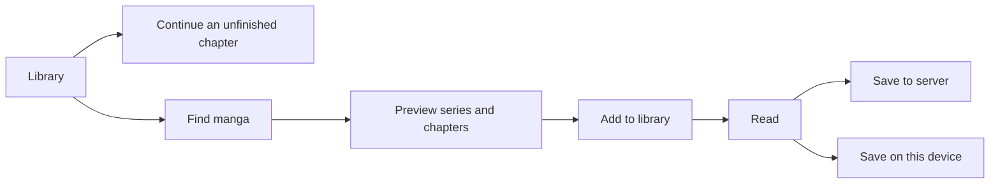

# Product and UX audit — September 5, 2026

Scanarr's strongest direction is a reading library with discovery and server management supporting it. Keep the Rails/Hotwire monolith: the major friction comes from workflow and state ownership, not the frontend framework. The existing cover-led visual language works; a wholesale visual redesign would leave the most important problems unresolved.

The server library is shared, while reading progress and follows are personal. Make that distinction explicit as multi-user workflows expand. Source identity matters for availability and recovery, but it should not be the first decision a returning reader makes.

## Intended everyday flow

This describes the product direction. Adding a series still applies existing follow/download preferences; this pass makes those consequences visible rather than silently changing saved behavior.

## What the audit covered

Reviewed setup/login, navigation, discovery/search, import effects, library filtering, series/chapter entry points, reading progress, server versus device downloads, error/empty states, mobile controls, and the jobs/storage decisions underneath them. Used the documented local development account and existing populated library (approximately 1,000 series), plus integration tests and browser-only network mocks for device failure/cancellation. The previous engineering findings remain in [the codebase audit](codebase-audit-2026-09-05.md).

The original home screen was a provider catalog. Search offered importing before inspection; importing could automatically queue an entire series. Reading, reporting, migration, export, and admin links had similar visual weight. Library filter results updated while their controls and dependent links became stale. These are flow problems, not merely styling problems.

## Implemented in this pass

| Journey | Improvement | Why it matters |
| --- | --- | --- |
| Return to reading | `/` now opens Library; Sources has `/sources`. A bounded shelf shows up to three recent unfinished chapters, one per series, scoped to the signed-in reader. | Returning readers can open a specific chapter without navigating source catalogs. Chapter links use public IDs, preserving variant identity. |
| Navigate | Reading, discovery, and history are prominent. Library tools and server management are expandable secondary groups; their current section opens automatically. | Maintenance stops competing with the daily reading path. Existing tools and routes remain accessible. |
| Find a series | Global search covers/titles open previews; imported results show “In your library” and “Open in library.” | Readers can inspect a title before adding it and avoid unnecessary reimports. |
| Understand adding | Search and preview explain effective follow/download defaults. Library-only filters are named accordingly. | Users can see that adding may queue server downloads and that those filters do not classify unknown remote results. |
| Browse sources | Offer only supported Browse/Search actions, show known availability problems, and link to existing imported series. | Unavailable or unsupported sources no longer promise the same experience as working ones. Manual retry and library access remain available. |
| Filter a collection | Controls, results, dependent links, and empty-state reset share one Turbo frame; URL/history advances with filters. Preserve search focus/cursor while replacing controls. | Back, reload, clear filters, Following sort options, and Random now agree with what is visible. |
| Understand status | “Downloading,” “Saved to server,” and “Has read chapters” replace ambiguous labels whose queries mixed download and reading state. | “Completed” no longer implies that an entire series has been read when the query only finds a completed chapter. Query behavior is unchanged. |
| Start with an empty library | Offer Find manga and Import a library. | New users have a useful next step without a new onboarding wizard. |
| Read on a phone | Filters wrap, resume cards stack, navigation uses a native dialog, and device actions have larger targets and visible text/progress. | The main flows fit a 390px viewport without horizontal overflow. |
| Save on a device | Keep Cancel enabled during an active request, display errors even before a local record exists, and distinguish device storage from server downloads. | A stalled or failed download has an observable state and a usable action. |
| Preserve reading progress | Persist pending progress on disconnect/pagehide; serialize queue flushes and retain newer updates arriving during a request. Fall back to direct online saving if localStorage is unavailable. | Leaving immediately after a page change no longer drops the pending update. |
| Use keyboard controls | Reading shortcuts ignore selects, buttons, links, editable content, and modified shortcuts. | Selecting a reading style or activating a control no longer unexpectedly flips a page. |
| See notifications | Update both sidebar badge instances using a shared selector rather than duplicate IDs. | Desktop and mobile counts update together. Notification list rows still need a broader real-time refresh design. |
| Trust reader content | WeebCentral rejects static branding and requires chapter-image evidence. A logo-only document produces a source error. | A live browser check found two site logos being presented as chapter 1172, including a false 100% reading display. Extension-only image matching was insufficient. |

## Product decisions still worth making

### 1. Separate adding, following, and downloading

These are three different user intentions. Today, import creates metadata, may create a follow, and may queue every chapter. The explanatory copy is an immediate repair, but the better product contract is an explicit choice of reading only, following updates, or downloading chapters. Preserve existing preferences through any migration and make the size/scope of bulk downloads visible before queueing.

### 2. Own the download lifecycle in one place

The previous audit found ineffective Sidekiq concurrency declarations, repeated state transitions, and inconsistent release selection. This directly affects UX: the app cannot promise “Saved” or “Cancelled” while multiple workers can modify the same deterministic paths. Atomic ownership, cancellation, retry, and published availability should belong to one module, verified with real concurrent workers.

### 3. Make multi-user chapter discovery a single operation

Current polling is per follow, but notifications depend on which job first inserts a chapter. Discover once per series/source and distribute results to eligible followers. A shared library needs independent personal notification and download policies.

### 4. Make discovery bounded and imports observable

Search creates workers per request and uses a separate timeout for each future. Import performs network and database work synchronously before returning. Bound search capacity across the process and give imports a durable job state, so users see whether an operation is queued, running, completed, or recoverably failed.

### 5. Treat device storage as its own product capability

Device deletion currently depends on a successful server unpin, so clearing downloaded chapters while disconnected is not dependable. Add queued removals/tombstones and reconcile on reconnect. Partition browser queues and cached ownership deliberately for users who share a browser. Browser storage limits and failures should be visible from the device library itself.

### 6. Finish accessible reader interaction

The lightbox still needs modal semantics, focus entry/trapping/restoration, and keyboard-accessible activation of pages. Verify these with a screen reader and mobile browser. The native-select shortcut repair in this pass does not constitute a full accessibility audit.

### 7. Invest in content validity and recovery

The logo-page incident shows why green parser fixtures are insufficient. Validate actual chapter image structure, distinguish a blocked source from an empty chapter, and offer alternate-source recovery from the failed series. Existing local cover blobs were missing in the development data; fallbacks kept the library navigable, but this pass did not rebuild that data or download the library again. Keep per-blob storage routing and backup/restore verification on the reliability roadmap.

### 8. Keep self-hosting operationally simple

Retain the single application architecture and focus on bounded memory/concurrency, clear storage locations, durable jobs, and an exercised restore path. External font loading can be bundled later to reduce third-party dependencies. Do not publish minimum hardware claims from the small archive microbenchmark alone.

## Verification and limits

- Browser: real local library at desktop and 390px mobile; live filtering, focus retention, Following sort choices, Random query parameters, Back restoration, empty-result reset, drawer navigation, and responsive source cards.
- Browser: reader navigation and native-select keyboard behavior; a real source returned branding instead of manga, prompting the parser repair. Rechecking the same URL after the fix returned zero reader images and an actionable source error. Current upstream availability is not guaranteed.
- Browser-only device mock: visible 503 error with retry enabled, then a stalled page request with visible progress and usable Cancel. Requests used synthetic endpoints intercepted in that isolated session; no account preference changes or real downloads were necessary.
- Final combined Ruby suite: **1,402 tests, 4,667 assertions, zero failures/errors/skips**. The focused source/reader run also passed 44 tests with 217 assertions, including replay of the recorded real chapter.
- JavaScript: 57 tests passed, including actual Stimulus lifecycle, queue races, device cancellation/errors, storage-unavailable fallback, and library input focus.
- Changed Ruby and ERB files passed their focused linters. TypeScript checking still reports existing Turbo module declaration and bulk-select `Element.style` errors; these remain separate maintenance work.
- No production deploy, container startup test, real S3 operation, full offline-on-phone test, or comprehensive screen-reader verification was performed. The local development server used `bin/dev` with assets and web enabled; its background worker was disabled during inspection.

## Next implementation order

1. Download ownership and truthful state transitions.
2. Explicit add/follow/download choice and observable import jobs.
3. Bounded search and one discovery pass per series/source with follower delivery.
4. Device removal reconciliation and accessible lightbox behavior.

This sequence addresses trust and daily usability before expanding the source catalog or redesigning more screens.

Source replacement was subsequently audited and implemented in more depth. See [the replacement UX audit](source-replacement-ux-audit-2026-09-05.md) for current reconciliation, reading continuity, and all-provider discovery behavior.
